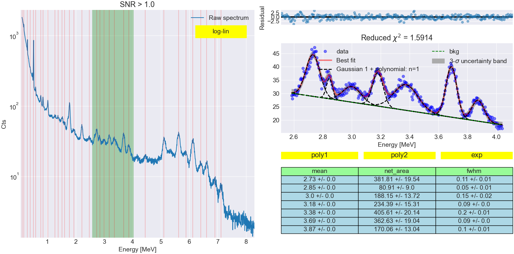

# NASA-gamma
Gamma spectrocopy tools and visualizations. Some of its capabilitis include:

1) Spectrum smoothing, rebinning, plotting
2) Peak searching based on given detector resolution and minimum SNR
3) Spectrum decomposition into signal, noise, and background
4) Peak fitting of multiple overlapping peaks with different background functions
5) Extraction of Gaussian components of peaks 
6) Energy calibration
7) GUI: energy calibration
8) GUI: peak fitting with advanced plotting and table of calculated parameters

## Installation
nasagamma runs on Python 3.6 or higher version. You can install it from PyPI via pip:
pip install nasagamma
or downoad it directly from https://github.com/mauricioAyllon/NASA-gamma
and run "pip install -e ." from the directory where the setup.py file is located

## Using nasagamma
Try running the following from the "examples" file:
"gammaGUI data/gui_test_data_cebr.csv --cebr"
or the following for the calibration GUI:
"ecalGUI data/gui_test_data_labr_uncalibrated.csv --e_units="MeV" --labr"

