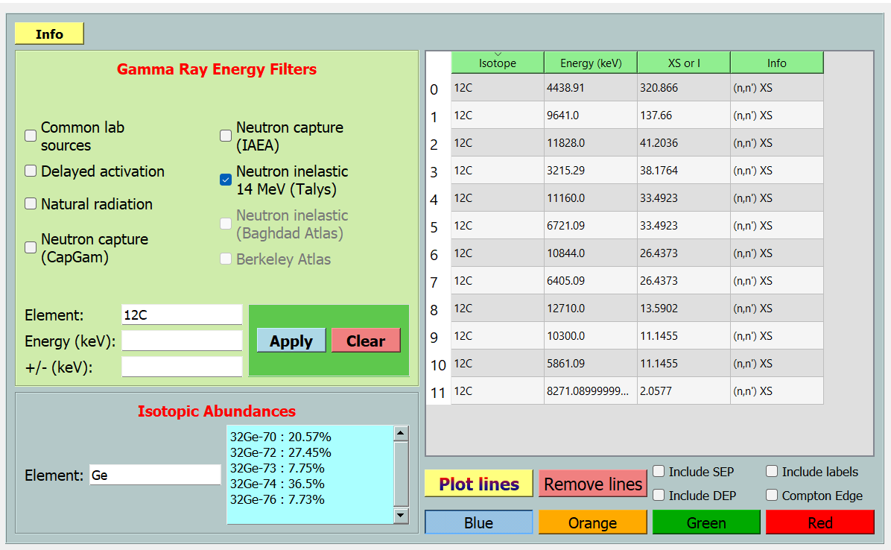
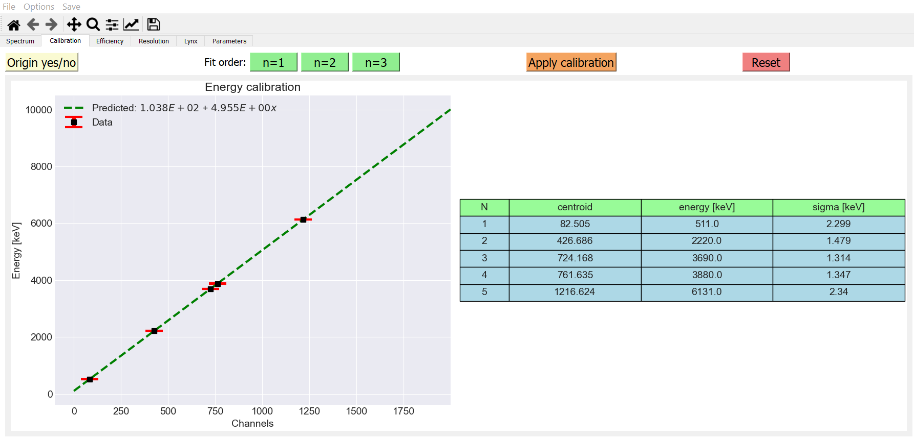

# NASA-gamma
Gamma spectrocopy tools and visualizations. Some of its capabilitis include:

1. Spectrum smoothing, rebinning, plotting
2. Peak searching given detector resolution and minimum SNR
3. Spectrum decomposition into signal, noise, and background
4. Peak fitting of multiple overlapping peaks with different background functions
5. Extraction of Gaussian components of peaks
6. Fully functional GUI
7. Energy calibration
8. Efficiency calibration
9. FWHM vs. energy plots
10. Time analysis from LYNX data
11. Data visualization for PIXIE data in the contect of Associated Particle Imaging (API)
12. Gamma energy identification with built-in databases. Emphasis is placed on neutron induced gamma ray emission.

## Installation
nasagamma runs on Python 3.6 or higher version. You can install it by
downloading the package directly using
```
git clone https://github.com/mauricioAyllon/NASA-gamma
```
and then run
```
pip install -e .
```
from the directory where the setup.py file is located.

## Using nasagamma
Try running the following (if the path is set correctly, the GUI can run from any directory.
Otherwise, run from inside the "NASA-gamma" folder):
```
python gammaGUI-qt -o
```
If running through the Spyder IDE, replace the keyword "Python" for "run".
The GUI window should appear.
Then select File -> open -> examples -> data -> gui_test_data_labr.csv.
Click on "Find peaks", select LaBr/CeBr and hit apply.
You should see several lines identified in the spectrum. Drag the mouse over one or more lines and feel free to play around.
Info buttons are placed strategically to guide the user.






## Development

Code contributions are welcome!

We use pre-commit to format the code with black. To enable pre-commit, you need to install it using:
```
pip install pre-commit
```
and then run
```
pre-commit install
```
inside the git repository.
