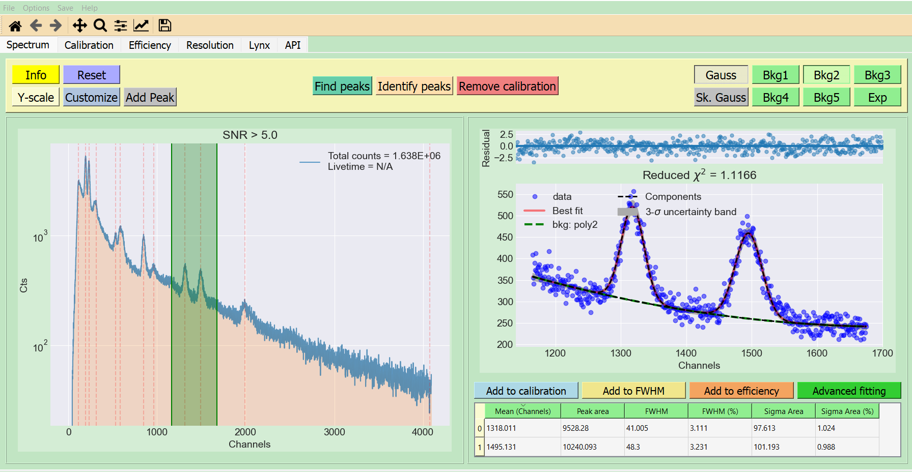

# NASA-gamma
Gamma spectrocopy tools and visualizations. Some of its capabilitis include:

1. Spectrum smoothing, rebinning, plotting
2. Peak searching given detector resolution and minimum SNR
3. Spectrum decomposition into signal, noise, and background
4. Peak fitting of multiple overlapping peaks with different background functions
5. Extraction of Gaussian components of peaks
6. Fully functional GUI
7. Energy calibration
8. Efficiency calibration
9. FWHM vs. energy plots
10. Time analysis from LYNX data

## Installation
nasagamma runs on Python 3.6 or higher version. You can install it by
downloading the package directly using
```
git clone https://github.com/mauricioAyllon/NASA-gamma
```
and then run
```
pip install -e .
```
from the directory where the setup.py file is located.

## Using nasagamma
Try running the following (if the path is set correctly, the GUI can run from any directory.
Otherwise, run from inside the "NASA-gamma" folder):
```
gammaGUI-qt -o
```




## Development

Code contributions are welcome!

We use pre-commit to format the code with black. To enable pre-commit, you need to install it using:
```
pip install pre-commit
```
and then run
```
pre-commit install
```
inside the git repository.
